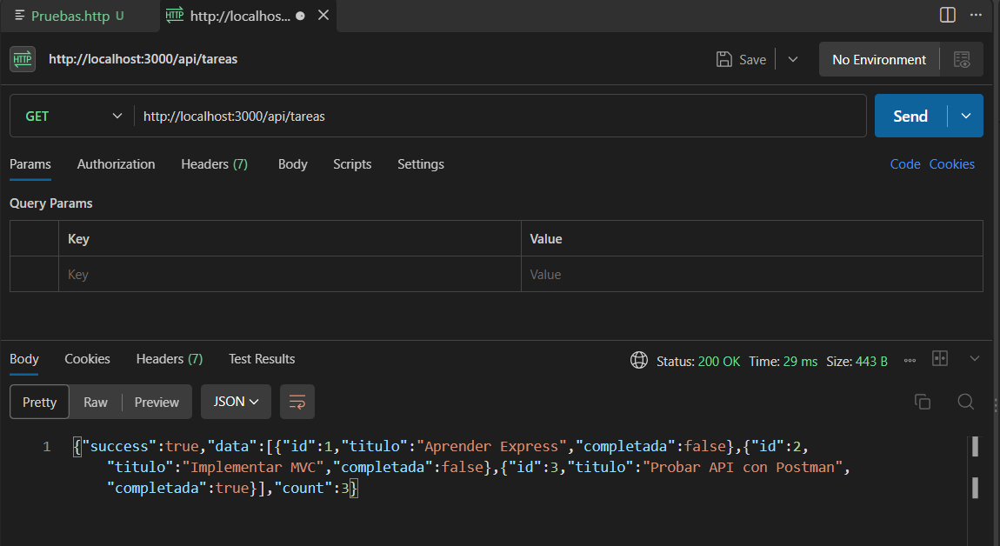
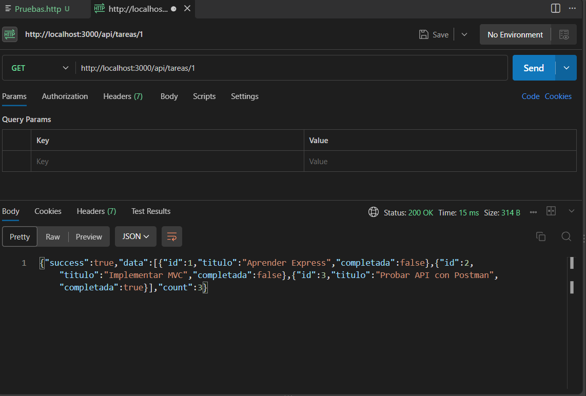
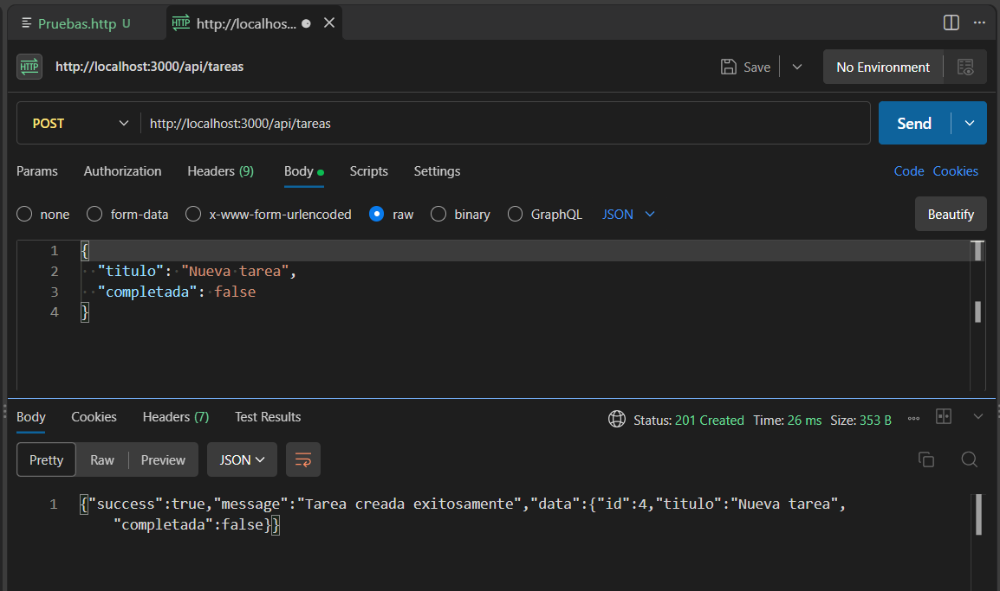
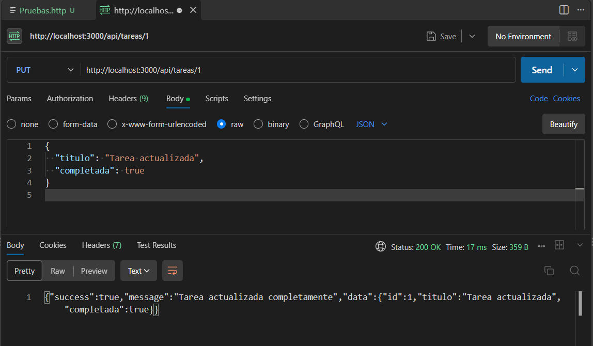
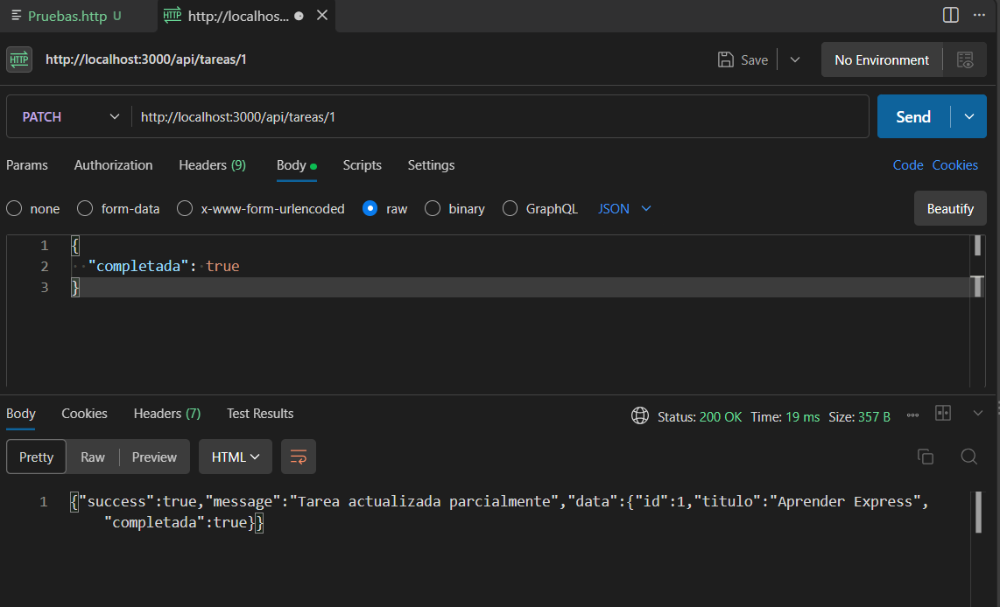
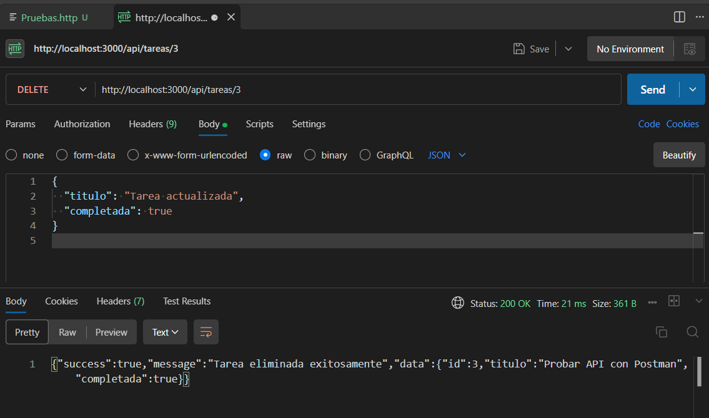

# API de Tareas

API REST construida con Node.js y Express, organizada con el patrón MVC. Permite consultar, buscar, crear, actualizar y eliminar tareas. Las respuestas se envían en formato JSON.

## Requisitos

- Node.js
- pnpm

## Instalación

Desde la carpeta `api-tareas-mvc`, instala las dependencias:

```bash
pnpm install
```

## Ejecución

Inicia el servidor de desarrollo con:

```bash
pnpm run dev
```

Por defecto, la API queda disponible en `http://localhost:3000`. La ruta raíz (`GET /`) devuelve un mensaje de bienvenida y un resumen de las rutas.

## Endpoints disponibles

| Método | Ruta | Descripción |
| --- | --- | --- |
| `GET` | `/` | Mensaje de bienvenida y resumen de endpoints. |
| `GET` | `/api/tareas` | Lista todas las tareas. |
| `GET` | `/api/tareas/buscar?q=express` | Busca tareas por coincidencia parcial en el título. El parámetro `q` es obligatorio. |
| `GET` | `/api/tareas/:id` | Obtiene una tarea por su ID. |
| `POST` | `/api/tareas` | Crea una tarea. Recibe JSON con `titulo` y, opcionalmente, `completada`. |
| `PUT` | `/api/tareas/:id` | Reemplaza una tarea. Recibe JSON con `titulo` y `completada`. |
| `PATCH` | `/api/tareas/:id` | Actualiza parcialmente una tarea. Recibe al menos un campo en JSON. |
| `DELETE` | `/api/tareas/:id` | Elimina una tarea por su ID. |

La colección de solicitudes HTTP incluida en [`test-collection.http`](./test-collection.http) contiene ejemplos para probar las rutas CRUD y la búsqueda.

## Estructura MVC

- **Modelo** (`src/models/tarea.model.js`): Mantiene las tareas en memoria y contiene las operaciones para consultarlas, buscarlas, crearlas, actualizarlas y eliminarlas.
- **Vista**: Representa los resultados como respuestas JSON que el cliente puede consumir.
- **Controlador** (`src/controllers/tarea.controller.js`): Recibe las solicitudes, valida parámetros y datos, llama al modelo y construye las respuestas JSON con sus códigos HTTP.
- **Rutas** (`src/routes/tarea.routes.js`): Conectan cada método y URL con la acción del controlador correspondiente. `src/app.js` configura Express y monta estas rutas bajo `/api/tareas`.

## Diferencia entre PUT y PATCH

- **PUT** reemplaza la tarea completa. Se debe enviar `titulo` y `completada`.
- **PATCH** modifica solo los campos incluidos en el cuerpo JSON y conserva los demás valores de la tarea.

## Códigos de estado HTTP

- **200 OK**: Utilizado para saber si la operación fue completada correctamente.
- **201 Created**: Se utiliza para saber si la tarea fue creada correctamente mediante `POST`.
- **400 Bad Request**: Se utiliza para saber si la solicitud fue inválida, como un ID no numérico, búsqueda sin `q`, ausencia del título requerido o un `PATCH` sin campos.
- **404 Not Found**: Sirve como retroalimentacion para saber si no existe una tarea con el ID solicitado o la ruta no está definida.
- **500 Internal Server Error**: Se usa para notificar un error inesperado al procesar una solicitud.

## Capturas de las pruebas en Postman

### GET: listar todas las tareas



### GET por ID: consultar una tarea



### POST: crear una tarea



### PUT: actualizar una tarea completa



### PATCH: actualizar una tarea parcialmente



### DELETE: eliminar una tarea


